# LLM Canvas

A browser-only canvas for learning how a Transformer language model is put together: place the parts,
wire them up, and see tensor shapes, parameter counts and memory estimates update as you go.

**Live demo: https://llmcanvas.netlify.app/**

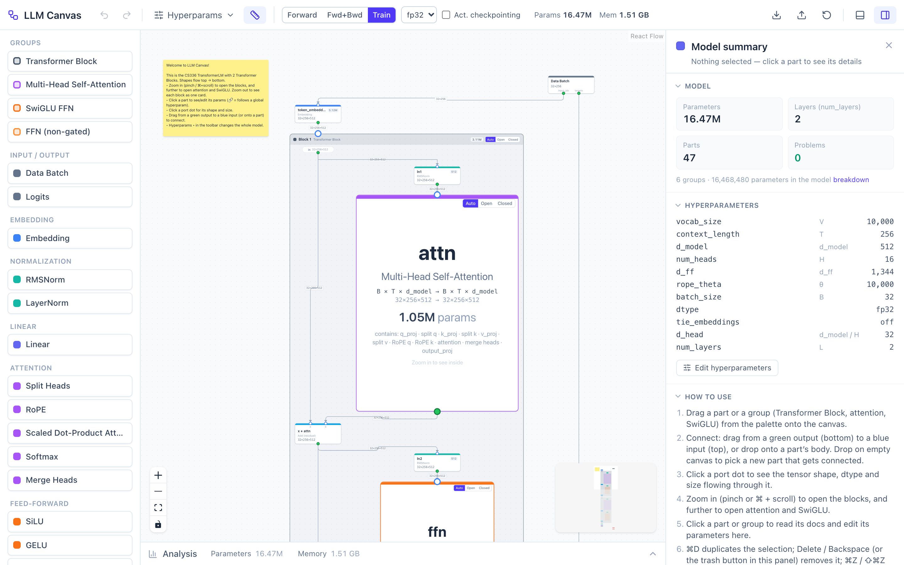

## What it is

LLM Canvas is a Miro-style whiteboard where the sticky notes are model parts: Embedding, RMSNorm, Linear,
RoPE, attention, SwiGLU, residual Adds, cross-entropy. You connect them top to bottom, and every edge carries
a tensor whose shape you can inspect. Change `d_model` and the whole graph re-traces. A Linear whose
`in_features` doesn't match its input turns red, and you can see that the attention probabilities and the
logits are where training memory goes.

**Nothing is executed.** There are no weights, no kernels and no backend. Shapes are traced through the graph,
and parameter counts and memory are plain arithmetic over those shapes, with the formulas shown next to the
numbers.

The reference model is the **TransformerLM from Stanford CS336 (Language Modeling from Scratch), Assignment 1**,
not the original *Attention Is All You Need* paper. That means:

- pre-norm blocks: `y = x + attn(RMSNorm(x))`, `out = y + ffn(RMSNorm(y))`
- RMSNorm (no LayerNorm), RoPE (no learned positional embeddings), SwiGLU feed-forward
- no biases in any Linear
- no weight tying between the token embedding and the LM head (it's available as a toggle)
- AdamW for the optimizer-state memory estimate

The default canvas, shapes, parameter formulas and the docs in the detail drawer follow that code.

## Features

### Canvas and editing
- **Palette** (left): groups (Transformer Block, Multi-Head Self-Attention, SwiGLU FFN, FFN non-gated), every
  part type by category, and annotations (sticky note, text box, frame). Drag items onto the canvas.
- **Connecting**: drag from a green output port (bottom of a part) to a blue input port (top), or drop onto a
  part's body to use its first free input. Dropping onto an input that is already connected replaces its edge.
  The canvas refuses cycles, output to output, and edges that cross a group boundary, and shows a hint
  explaining why.
- **Quick-add**: let go of a connection on empty canvas and a searchable menu opens at that point. The part you
  pick is created already connected (inside a group when you drop on the group's empty area). It's also under
  right-click → *Add part here…*.
- **Context menus** on parts, groups, edges, frames, selections and empty canvas: show details, duplicate,
  put in a frame, delete, fit view, undo/redo, and so on.
- **Delete** with Delete/Backspace, the trash button in the drawer, the context menu, or the × on a
  selected edge. Deleting a group takes its parts with it.
- **Duplicate** with ⌘/Ctrl+D (copies include internal edges; new blocks are renumbered).
- **Undo / redo** for every graph edit (adding, deleting, connecting, moving, resizing, params, titles,
  hyperparameters, reset/import), with toolbar buttons and ⌘Z / ⇧⌘Z / Ctrl+Y. Typing into a field counts as
  one step.
- **Frames**: titled, coloured, resizable rectangles for labelling regions. Dragging a frame moves everything
  fully inside it. Frames are visual only and don't affect shapes, parameters or memory.
- **Sticky notes and text boxes** with background and text colour, font size and resizing. Double-click to edit.
- **Autosave** to `localStorage`, plus **Export / Import JSON** and **Reset** to the CS336 default.

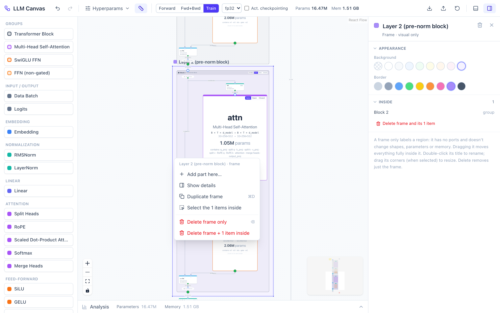

### Shape tracing and errors
- Every port and edge has a shape, both **symbolic** (`B × T × d_model`) and **concrete** (`32 × 256 × 512`).
  The concrete shape is shown on edges (toggle *Shapes on edges* in the toolbar). Click a port for symbolic and
  concrete shape, dtype and size in bytes.
- Errors are checked per part: missing input, `in_features` ≠ last input dim, `d_model` not divisible by
  `num_heads`, odd head dim for RoPE, `seq_len > context_length`, mismatched shapes into an Add or Multiply,
  cycles. The part turns red with a readable message (on hover, and at the top of its drawer).
- Downstream of an error, shapes are shown as **unknown** (grey, dashed) instead of cascading red errors.

<p>
  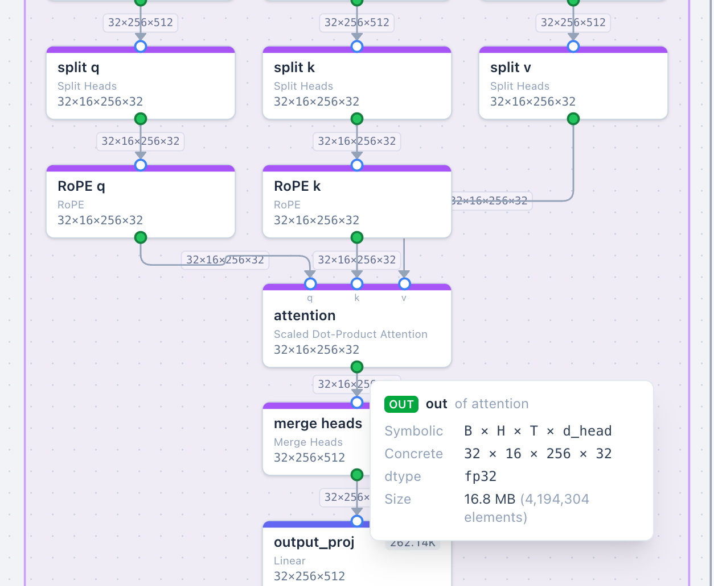
  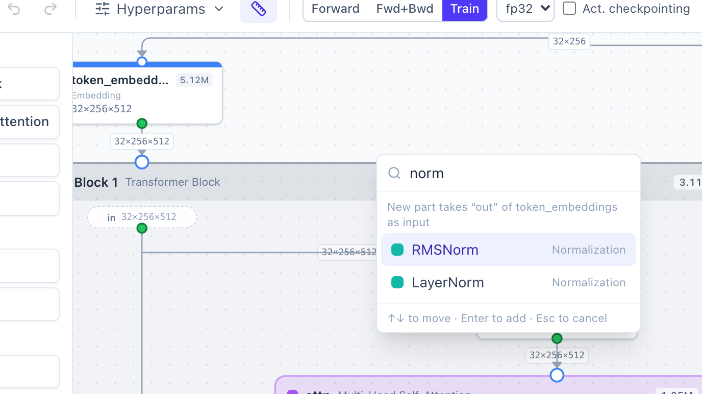
</p>

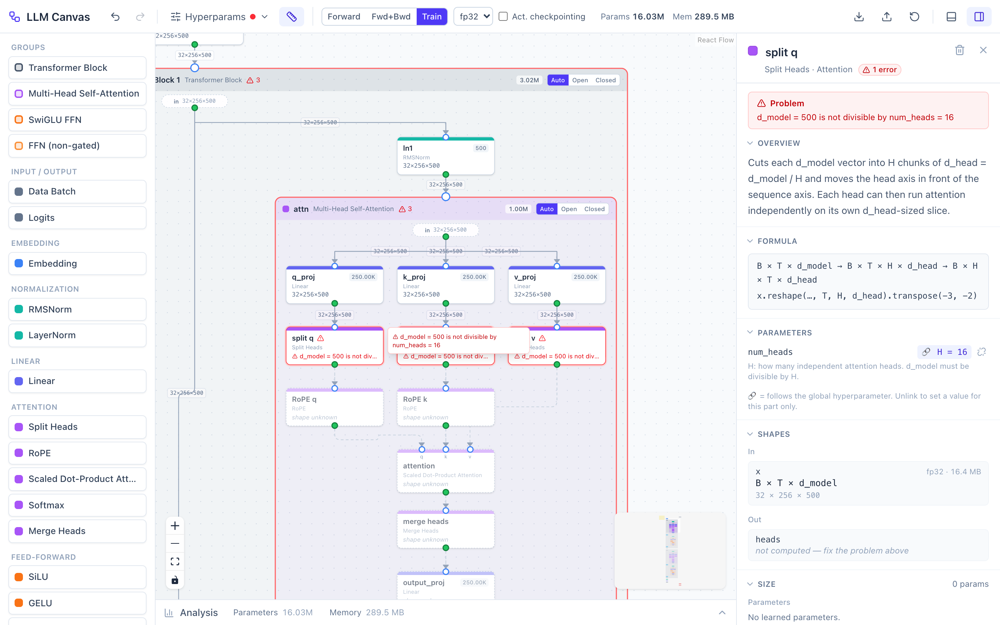

### Groups and semantic zoom
- **Transformer Block**, **Multi-Head Self-Attention**, **SwiGLU FFN** and **FFN (non-gated)** are groups with
  their own in/out ports. Blocks contain an MHA and a SwiGLU group, so they nest.
- What you see depends on the zoom level. Zoomed out, each block is a single card with its shapes, parameter count
  and problems. In the middle range, a block's RMSNorms and residual Adds appear while attention and SwiGLU are
  still cards. Zoomed in, the attention and SwiGLU internals open up.
- Each group has an **Auto / Open / Closed** override.
- `num_layers` isn't a number you type. It's the number of Transformer Block groups on the canvas. Add a
  layer by dragging a block from the palette or duplicating one.

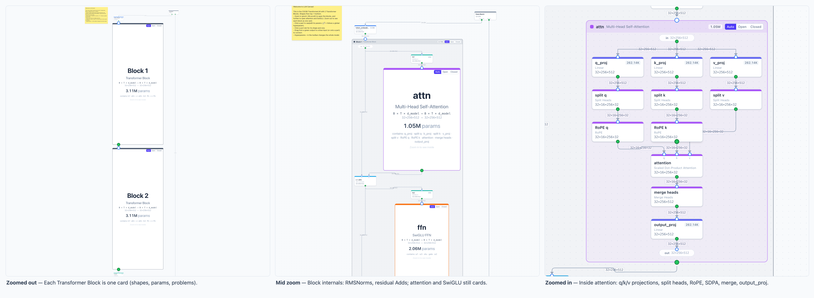

### Detail drawer
Click a part or group to open the right-hand drawer. It has these sections: **Errors**, **Overview** (with
the role of this particular instance, e.g. `q_proj` or `ln_final`), **Formula**, **Parameters** (editable;
🔗 means bound to a global hyperparameter, with *Unlink* to override it locally and *Relink* to go back),
**Shapes** (in/out, symbolic + concrete + bytes), **Size** (weights, share of the model, and this part's
memory contribution in the current mode), **Points to remember**, and a **CS336 reference** (file and
symbol). Groups also show a per-child parameter breakdown. With nothing selected, the drawer shows a model
summary: parameters, layers, problems (click to jump to them), the hyperparameters, and a short how-to.

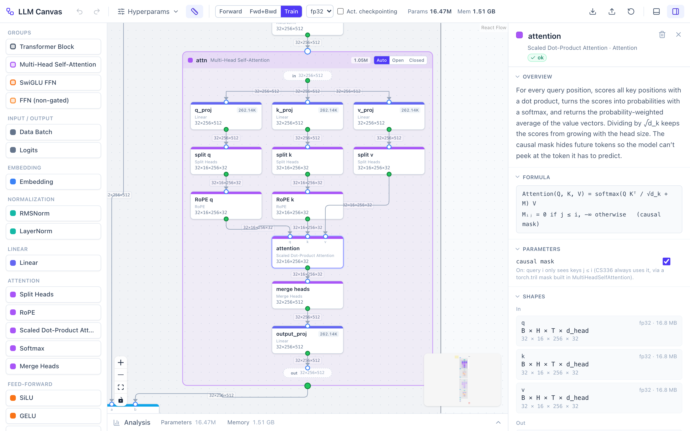

### Hyperparameters and binding
The global hyperparameters are `vocab_size`, `context_length`, `d_model`, `num_heads`, `d_ff`, `rope_theta`,
`batch_size`, `dtype` (fp32 / bf16 / fp16) and `tie_embeddings`, edited in the toolbar's
**Hyperparams ▾** popover. `d_head` and `num_layers` are shown as derived values. Part parameters follow
these by default and can be overridden per part.

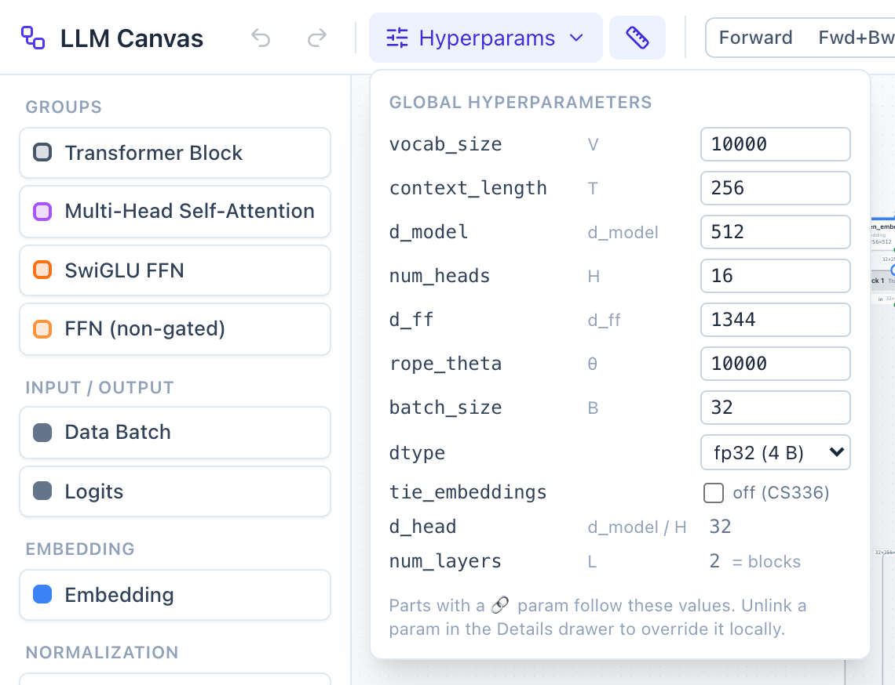

### Parameter accounting (Analysis → Parameters)
- Every part and group shows its parameter count, and the toolbar shows the model total.
- The total is written out as the CS336 formula with the numbers substituted, plus a ✓ when it matches the canvas.
  When it doesn't match (e.g. an extra Linear, a non-gated FFN or LayerNorm), the panel lists the
  per-category difference.
- A stacked bar shows where the parameters live (Embedding / Attention / FFN / Norms / LM head / Other).
  Click a category to **highlight** those parts on the canvas (Esc clears). There's also a per-layer list
  (click a row to focus it) and a few short insights.
- Only the **connected model** counts: parts that feed Logits / Loss. A stray Linear or a block that isn't wired
  in is shown in amber as "not counted".

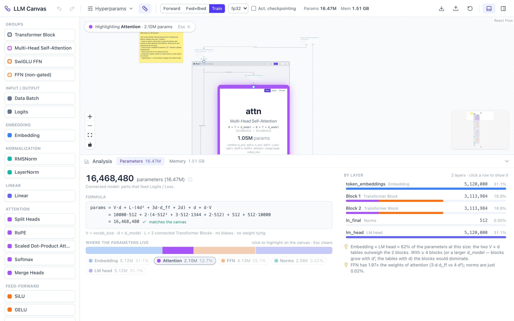

### Memory estimation (Analysis → Memory)
- **Modes** (toolbar): **Forward** (inference), **Fwd+Bwd**, **Train** (AdamW). **dtype** fp32 / bf16 / fp16.
- **Activation checkpointing** toggle (as in CS336's `checkpoint_blocks`): keep only each block's input and
  recompute the block during backward.
- Breakdown **by component** (weights, gradients, optimizer, activations, buffers, KV cache) with the formulas
  and numbers. Activations are broken down **by category** (attention probs, attention other, FFN, norms,
  embedding, logits / loss, residual), with click-to-highlight, **by layer**, and as a list of the **biggest
  tensors** with who saves them for backward.
- *Where to optimise* insights. With the defaults, the attention probabilities (`B·H·T²` per layer) and the
  logits (`B·T·V`) dominate.
- **Heat on canvas** tints parts by the activation memory they hold.
- **Generation (KV cache)** switch (Forward mode only). It estimates autoregressive decoding as weights +
  RoPE buffers + the K/V cache of every attention layer + one decode step, with adjustable `T_cache` and batch.
  The panel adds a per-layer KV-cache section and the per-token cost.

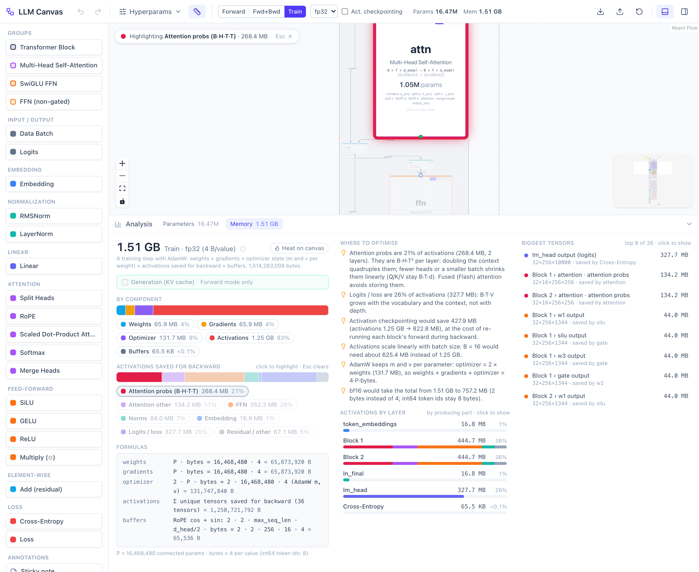

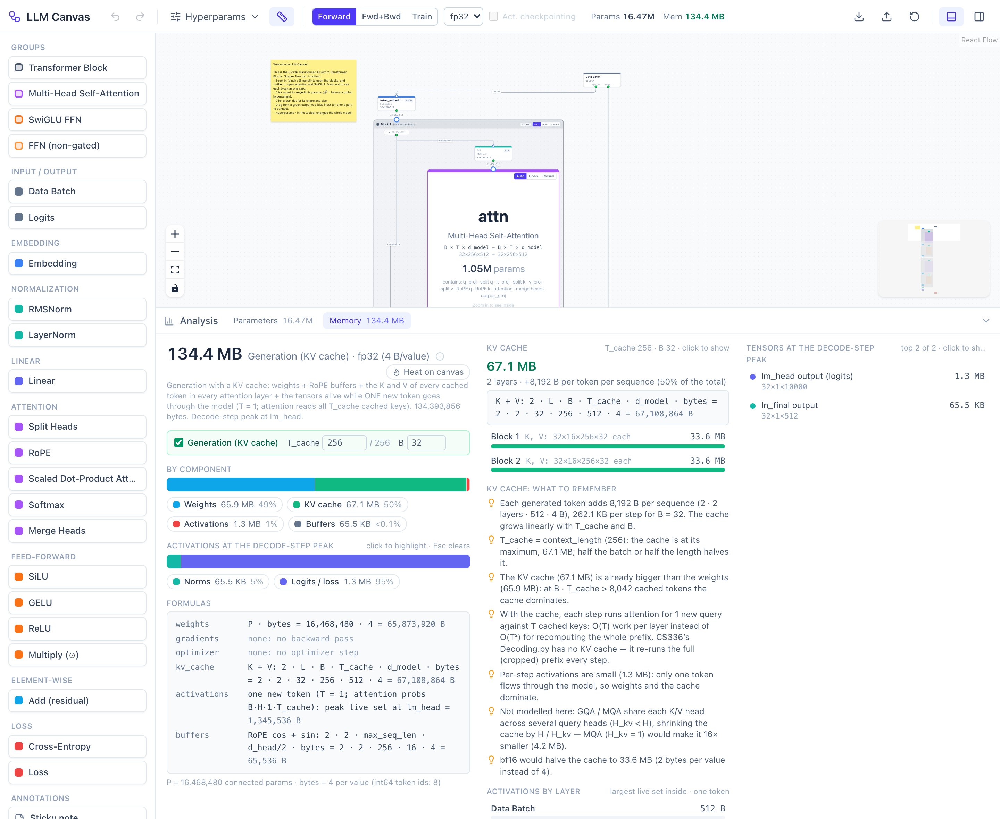

### Part catalog
| Category | Parts |
|---|---|
| Groups | Transformer Block, Multi-Head Self-Attention, SwiGLU FFN, FFN (non-gated) |
| Input / output | Data Batch (`input_ids`, `targets`), Logits |
| Embedding | Embedding |
| Normalization | RMSNorm, LayerNorm *(variant)* |
| Linear | Linear (no bias) |
| Attention | Split Heads, RoPE, Scaled Dot-Product Attention (causal), Softmax, Merge Heads |
| Feed-forward | SiLU, GELU *(variant)*, ReLU *(variant)*, Multiply (⊙) |
| Element-wise | Add (residual) |
| Loss | Cross-Entropy, Loss |
| Annotations | Sticky note, Text box, Frame |

The *variants* (LayerNorm, GELU, ReLU, the non-gated FFN, and the weight-tying toggle) aren't in the CS336 code.
They're there so you can compare, and their drawer says so. To swap a block's FFN, delete its SwiGLU group,
drag from `ln2`'s output onto the empty block area, pick *FFN (non-gated)* in the quick-add menu, and wire its
output to `x + ffn`.

## How to use

1. Open the [live demo](https://llmcanvas.netlify.app/) (or run it locally). You start with the CS336 model:
   Data Batch → Embedding → Block 1 → Block 2 → `ln_final` → `lm_head` → Logits → Cross-Entropy → Loss.
2. Pinch or ⌘/Ctrl+scroll to **zoom**. Zoom in to open a block, and further to open attention and SwiGLU.
3. **Click a part** to read its docs and edit its parameters in the drawer. **Click a port dot** for its shape.
4. Open **Hyperparams ▾** and change `d_model`, `num_heads`, `context_length`… and watch shapes, the
   parameter total and the memory estimate update. Try `d_model = 500` to see an error.
5. Open **Analysis** (bottom) → **Parameters** / **Memory**. Click categories to highlight them on the canvas,
   switch the mode, toggle checkpointing, or turn on *Generation (KV cache)* in Forward mode.
6. Build things: drag a Transformer Block from the palette and wire it in (the layer count and formula follow),
   or drop a connection on empty canvas to add a connected part.
7. Your canvas is saved in the browser. Use **Export JSON** to keep a copy, and **Reset** to go back to the default.

### Controls

| Action | How |
|---|---|
| Pan | Drag empty canvas, or two-finger scroll (a plain mouse wheel pans too) |
| Zoom | Pinch, or ⌘/Ctrl + wheel; buttons bottom-left; right-click → *Fit view* |
| Select / add to selection | Click; Shift/⌘ + click |
| Box select | Shift + drag on empty canvas |
| Connect | Drag from a green output (bottom) to a blue input (top) or onto a part's body |
| Add a connected part | Release a connection on empty canvas → quick-add (type to filter, ↑/↓, Enter, Esc) |
| Shape of a port | Click the port dot |
| Delete | Delete / Backspace, drawer trash button, right-click → Delete, × on a selected edge |
| Duplicate | ⌘/Ctrl + D |
| Undo / redo | ⌘/Ctrl + Z, ⇧⌘/Ctrl + Z or Ctrl + Y (not while typing in a field); toolbar buttons |
| Edit text / rename a frame | Double-click a sticky note, text box or frame title |
| More actions | Right-click a part, group, edge, frame, selection or empty canvas |
| Clear a highlight / close a popover | Esc |

Double-click doesn't zoom, because it's used for editing. Dragging a frame's body moves the frame, so pan
with two-finger scroll when you're over a big frame.

## The default model

CS336 `train.py` defaults, except the default canvas has **2** Transformer Blocks instead of 4 (add more from
the palette).

| Hyperparameter | Symbol | Default |
|---|---|---|
| `vocab_size` | V | 10,000 |
| `context_length` | T | 256 |
| `d_model` | d | 512 |
| `num_heads` | H | 16 (`d_head` = 32) |
| `d_ff` | d_ff | 1,344 |
| `rope_theta` | θ | 10,000 |
| `batch_size` | B | 32 |
| `dtype` | | fp32 |
| `tie_embeddings` | | off |
| `num_layers` | L | 2 (= blocks on the canvas) |

**Parameters: 16,468,480**

```
params = V·d + L·(4d² + 3d·d_ff + 2d) + d + d·V
       = 10000·512 + 2·(4·512² + 3·512·1344 + 2·512) + 512 + 512·10000
       = 5,120,000 (embedding) + 2 × 3,113,984 (blocks) + 512 (ln_final) + 5,120,000 (lm_head)
```

With 4 blocks it's 22,696,448. With weight tying on it's 11,348,480 (the `+ d·V` term goes away).

**Memory (fp32, 2 blocks)**

| Mode | Estimate | Notes |
|---|---|---|
| Forward | 410.4 MB | peak at `lm_head`: its input + the 32×256×10000 logits |
| Fwd+Bwd | 1.38 GB | activations saved for backward: 1.25 GB |
| Train (AdamW) | 1.51 GB | + gradients and AdamW m, v |
| Train + activation checkpointing | 1.09 GB | activations 822.8 MB |
| Forward + Generation (KV cache) | 134.4 MB | KV cache 67.1 MB (T_cache 256, B 32), weights 65.9 MB |

## How the numbers are computed

- **Shapes**: each part type has an `infer` function. The graph is evaluated in topological order, and groups
  are flattened first (a group's outer ports are redirected to its inner in/out proxies), so inference never
  depends on zoom or collapse state.
- **Parameters**: each part declares its weight tensors (e.g. Linear `out × in`, RMSNorm `d`). Groups sum their
  children. The model total only counts parts connected to Logits / Loss.
- **Memory** (`b` = bytes per value; int64 token ids are always 8 bytes; P = connected parameters):

  | Component | Forward | Fwd+Bwd | Train |
  |---|---|---|---|
  | Weights | P·b | P·b | P·b |
  | Gradients | – | P·b | P·b |
  | Optimizer (AdamW m, v) | – | – | 2·P·b |
  | Activations | peak live set (a part's inputs + outputs + temporaries such as the attention probs) | tensors saved for backward | same |
  | Buffers | RoPE cos/sin, once per attention group | same | same |

  Each part type declares what it **saves for backward** (Linear: its input; RMSNorm: input + rms;
  SDPA: Q, K, V and the `B×H×T×T` probabilities; Cross-Entropy: logits + targets; …). Each tensor is counted
  **once**, even when several parts save it. For example, the RMSNorm output feeding q/k/v_proj is stored once.
- **Activation checkpointing**: tensors saved only inside a Transformer Block are dropped. Each block's input
  is kept (`L·B·T·d`), and the largest block's saved tensors are added once, since that block is recomputed
  during backward.
- **KV cache**: for every connected attention part, K (after RoPE) and V of `B × H × T_cache × d_head` each,
  i.e. `2 · L · B · T_cache · d_model · b`. The decode-step activations come from re-tracing the graph with a
  sequence length of 1.

### Limitations
- These are **educational estimates**, not what `torch.cuda.max_memory_allocated` would report. Allocator
  overhead and fragmentation, the CUDA context, and transient activation gradients aren't modelled.
- No fused kernels (e.g. FlashAttention never materialising the `T×T` probabilities), no mixed-precision
  master weights, and a single dtype for everything.
- Only the tensors each part declares as saved for backward are counted. Real PyTorch autograd on CS336's
  hand-written softmax / cross-entropy keeps a few extra `B·H·T²` / `B·T·V` intermediates.
- GQA / MQA, paged or quantised KV caches aren't modelled (GQA/MQA only appears as a note). CS336's own
  `Decoding.py` has no KV cache.
- The memory mode, checkpointing and generation settings are UI state. They aren't saved in the document or
  undoable (dtype is a hyperparameter, so it is).
- Parts dropped from the palette onto an open group land at the top level. Use quick-add inside the group to
  create a part there. There's no post-norm block template.
- The toolbar's layer count includes blocks that aren't wired in, while the formula's `L` counts connected blocks.

## Run locally

Prerequisites: Node.js 22+ and [pnpm](https://pnpm.io/).

```sh
pnpm install
pnpm dev          # dev server at http://localhost:5173
pnpm test         # Vitest (engine, store and canvas logic)
pnpm typecheck    # tsc
pnpm build        # typecheck + production build to dist/
pnpm preview      # serve dist/
```

**Screenshots.** The images in `docs/screenshots/` are taken by `scripts/screenshots.mjs` with Playwright.
It builds the app, serves `dist/` with `vite preview` on a free port, drives the UI in a fresh browser
context (default graph) at 1440×900 with deviceScaleFactor 2 (the Analysis shots make the panel taller, and the
Memory / KV-cache ones the window too, so a whole tab fits), and stops the server afterwards. Chromium is installed inside the
project (`.playwright-browsers/`, git-ignored):

```sh
pnpm screenshots:install    # once: Chromium into ./.playwright-browsers
pnpm screenshots            # all shots
pnpm screenshots memory kv  # only shots whose name contains these words
SHOTS_URL=http://localhost:5173 pnpm screenshots   # reuse a running dev server
```

**Deploy.** The app is fully static. Deploy `dist/` anywhere. The live demo is on Netlify (build command
`pnpm build`, publish directory `dist`).

## Project structure

```
src/
  engine/       pure TypeScript, no React, unit-tested
                types, hyperparams, resolve (bind vs override), shape, infer (shape propagation + errors),
                groups (flattenGroups), params (accounting + formula), memory (modes, checkpointing, KV cache),
                tying, format
  nodes/        one file per part type (ports, params schema, infer, paramCount, savedForBackward, docs),
                groups.ts (group definitions), registry.ts (NODE_DEFS, categories, colours)
  defaults/     cs336Graph.ts — the default canvas
  store/        Zustand store (useCanvasStore: every graph edit is an undoable action), inference bridge,
                persistence (document format + validation), history (undo/redo)
  canvas/       React Flow wiring: Canvas, node components, ports, edges, semantic zoom (lod), connection rules,
                quick-add, context menu, frames, group templates
  panels/       Toolbar, Palette, DetailDrawer (+ drawer/ sections), AnalysisPanel (+ analysis/ tabs)
scripts/        screenshots.mjs
docs/           REQUIREMENTS.md, PLAN.md, PROGRESS.md, screenshots/
```

### Adding a new part type
1. Create `src/nodes/<part>.ts` exporting a `NodeDef`: `type`, `label`, `category`, `inputs` / `outputs`,
   `params` (each bound to a hyperparameter or with a default), `infer` (output shapes + error messages),
   `paramCount` (weight tensors), `savedForBackward`, and `docs` (overview, formula, points to remember, and a
   `cs336Ref` or a `cs336Note`). `src/nodes/gelu.ts` is a short example.
2. Add it to `NODE_DEFS` in `src/nodes/registry.ts`. The palette and quick-add pick it up automatically.
3. Add tests in `src/engine/*.test.ts` for its shapes, parameters and saved tensors. `src/nodes/docs.test.ts`
   checks that its docs are complete.
4. If it has weights in a new place, check how `src/engine/params.ts` and `memory.ts` categorise it.

## Docs
- [docs/REQUIREMENTS.md](docs/REQUIREMENTS.md): what the app should do (R1–R9)
- [docs/PLAN.md](docs/PLAN.md): architecture, node catalog, parameter and memory formulas, phases
- [docs/PROGRESS.md](docs/PROGRESS.md): session-by-session log with decisions and gotchas

## Acknowledgements
- [Stanford CS336: Language Modeling from Scratch](https://cs336.stanford.edu/). The reference model,
  default hyperparameters and much of the docs content follow Assignment 1.
- [React Flow](https://reactflow.dev/) (`@xyflow/react`) for the canvas, plus Zustand, Tailwind CSS,
  lucide-react and Vite.

## License
[MIT](LICENSE)
